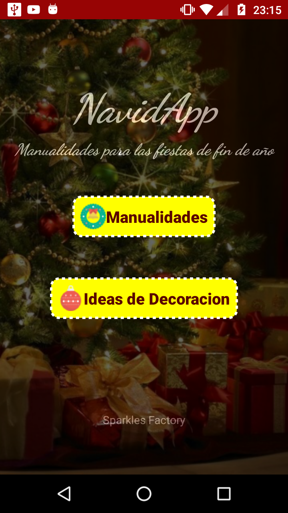
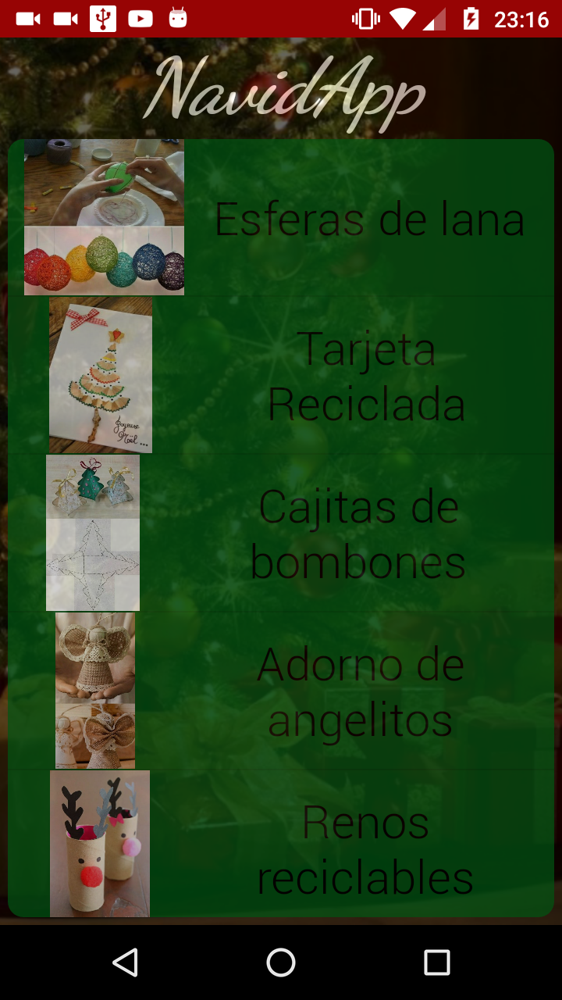
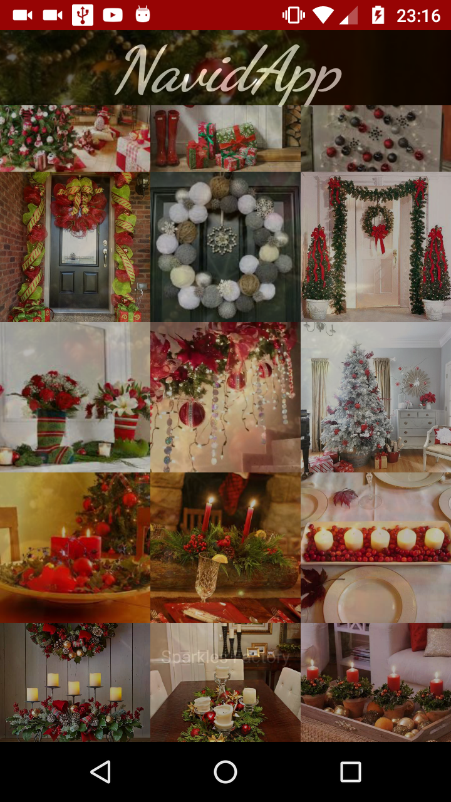
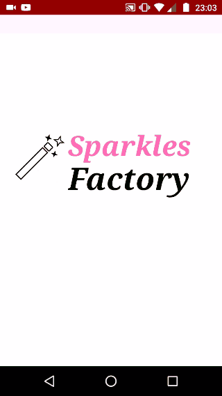
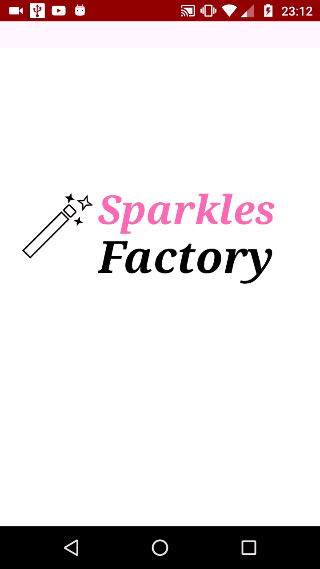

Proyecto Final - Study Jam II 2016
===

    

        
    

Repositorio Proyecto Final del Study Jam Android Development for Beginners II 2016, llevado a cabo en la ciudad de La Paz, Bolivia a cargo del <a target="_blank" href="http://www.gdg.androidbolivia.com">GDG Android Bolivia</a> .

Nombre Aplicación.
---
El nombre de la aplicación es: NaviApp

Objetivo
---
Mostrar manualidades paso a paso e imagenes de decoraciones

Caracteristicas
---
* Galeria de imagenes
* Opciones de compartir con amigos

Wireframes
---
Puedes visualizar los Wireframes de este proyecto.

https://ninjamock.com/s/VRV4G

Compatibilidad
---
Esta aplicación es compatible con versiones de Android 4.0.2 (Ice Cream) o superior.

Uso
---------
Para probar este ejemplo clona este repositorio de la siguiente forma:
>
>     $ git clone https://github.com/Gusn8/ProyectoFinal_StudyJam.git

Luego de ello dentro de Android Studio:

* File --> New --> Import Project 
* Seleccionas la ruta donde hiciste el `clone` del proyecto.
* Build --> Rebuild Project
* Run 

Corrida previa
---
Aca te muestro cual es el funcionamiento de mi aplicación a grandes rasgos.

    

        <table border="0">
            <tr>
            
                <td></td>
                <td></td>
                <td></td>
                <td></td>
                <td></td>
            </tr>
        </table>
    

 

Descripción técnica
---
En este proyecto de utilizáron los siguientes componentes tanto en el `diseño` como en la `funcionalidad`:

**`Vista:`**
* LinearLayout (Vertical y Horizontal) para la alineación de las vistas principales.
* ListView para el listado de las manualidades
* GridView para la Galeria de imagenes
* Animaciones para la introduccion
.
.
.

**`Funcionalidad:`**
* Clases adaptadoras para las listas
* Intents implicitas para compartir las imagenes o las indicaciones de las manualidades
.
.
.

Autor(a)
---
Adriana Ingrid Centellas

Universidad
---

    

        
    

Contactos
---
* Correo electronico: adrianacentellas98@gmail.com
* Whatsapp: +59172570385

[Facebook](https://www.facebook.com/adriana.centellas1)  
[Instagram](https://www.instagram.com/ai.centellas/) 
[Github](https://www.github.com/adrisparkle) 
